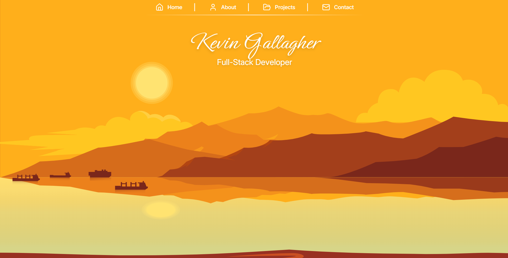
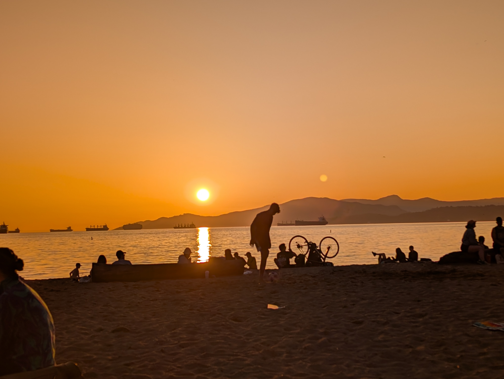
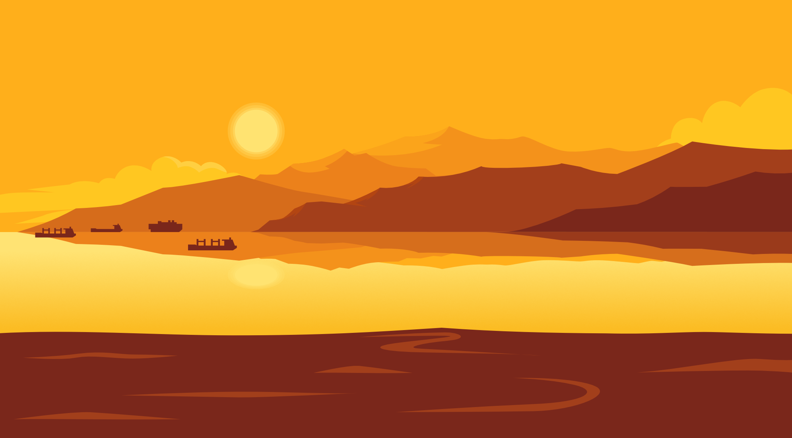
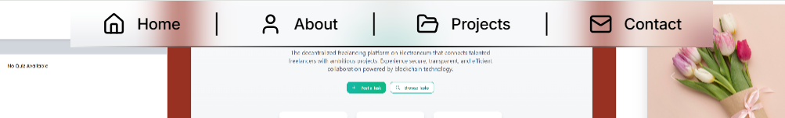
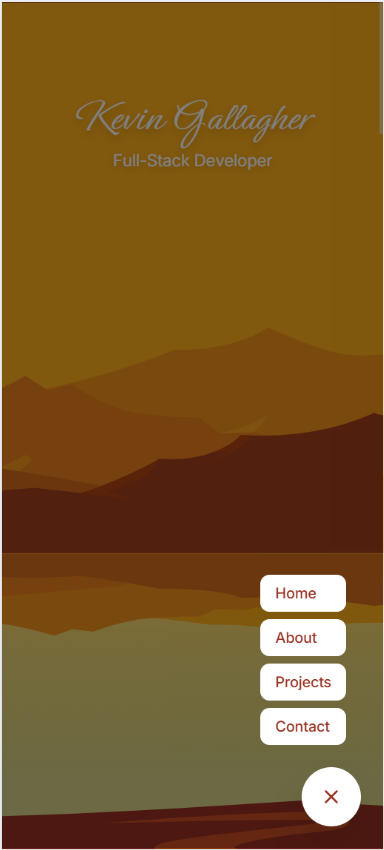
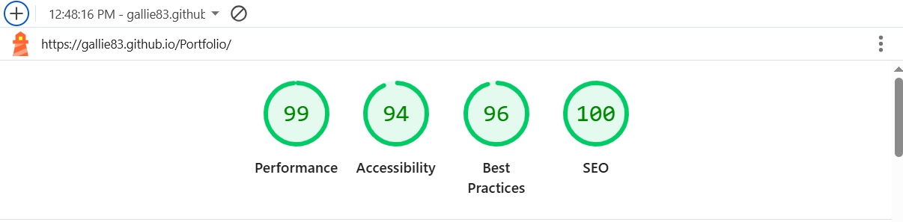

# Welcome to my website! 👋

🌐 [Live Website](https://gallie83.github.io/Portfolio/)

The inspiration for this website came mainly from two places, [Firewatch](https://www.firewatchgame.com/) and my favorite place in Vancouver - English Bay.

## Features

- 🏔️ **Immersive Parallax Homepage** - Multi-layered landscape with depth-based scrolling
- 📱 **Fully Responsive Design** - Optimized for mobile, tablet, and desktop
- 🎨 **Interactive Project Gallery** - Filterable by technology with detailed modal views
- 📜 **Certificate Display** - Clickable education credentials in accessible dialogs
- ⚡ **Smooth Navigation** - GSAP-powered scrolling with adaptive navbar

## Parallax Effect

The website uses a parallax effect where each layer scrolls at different speeds, with the closer layers scrolling faster to add a sense of depth to the website. To achieve this I am using the [react-spring](https://react-spring.dev/) library which has a built in [Parallax](https://react-spring.dev/docs/components/parallax) functionality.

## English Bay

While watching another beautiful sunset at english bay, something about the colors in the sky and the way the layers sat across the horizon made me think of the Firewatch website.

So I contacted an artist on Fiverr - [Ibrahim](https://www.fiverr.com/users/boimwoim/portfolio?roleIds=), who I felt could capture the style I was envisioning. After a couple tweaks and revisions we had the finished image to be used on my homepage, with each element as it's own SVG layer to achieve the parallax effect.

## Design Choices

Firstly, a huge thank you to my good friend and amazing designer [Conor Casey](https://www.linkedin.com/in/conor-casey-102/)(Check him out he's awesome) for his input on design choices for this website.

**Typography**
The main font chosen was [Inter](https://fonts.google.com/specimen/Inter) from Google Fonts.
I chose [Ephesis](https://fonts.google.com/specimen/Ephesis) for the name heading font as it gave the homescreen a nice 'postcard' aesthetic with the sunset background.

**Color Palette**

The Colors for the site were dictated by the homescreens parallax landscape (#FFB74D, #983122) for visual consistency.

**Navbars**

The website features 2 different Navbars depending on screen size

The Navbar for larger screens will change color depending on the current scroll position with backdrop blur to ensure legibilty.

For the mobile Navbar I wanted it to be user friendly as possible, so there I decided to model it as a floating action button placed in the bottom right of the screen, closest to most users thumb position.

## Technologies Used

- [React](https://react.dev/) - JavaScript library for building the user interface
- [TypeScript](https://www.typescriptlang.org/) - Type-safe JavaScript for improved development experience
- [Vite](https://vitejs.dev/) - Fast build tool and development server
- [Tailwind CSS](https://tailwindcss.com/) - CSS framework for styling
- [shadcn/ui](https://ui.shadcn.com/) - Reusable component library
- [react-spring/parallax](https://www.react-spring.dev/) - Animation library for the parallax scrolling effect
- [GSAP](https://gsap.com/) - Animation library for smooth scroll navigation
- [Git](https://git-scm.com/) - Version control
- [GitHub](https://github.com/) - Repository hosting and version control

## Lighthouse Testing

Despite the custom parallax scrolling effect with multiple animated layers, the website shows excellent performance across all metrics while maintaining an immersive visual experience:

**Production Scores:** Performance 99 | Accessibility 94 | Best Practices 96 | SEO 100
